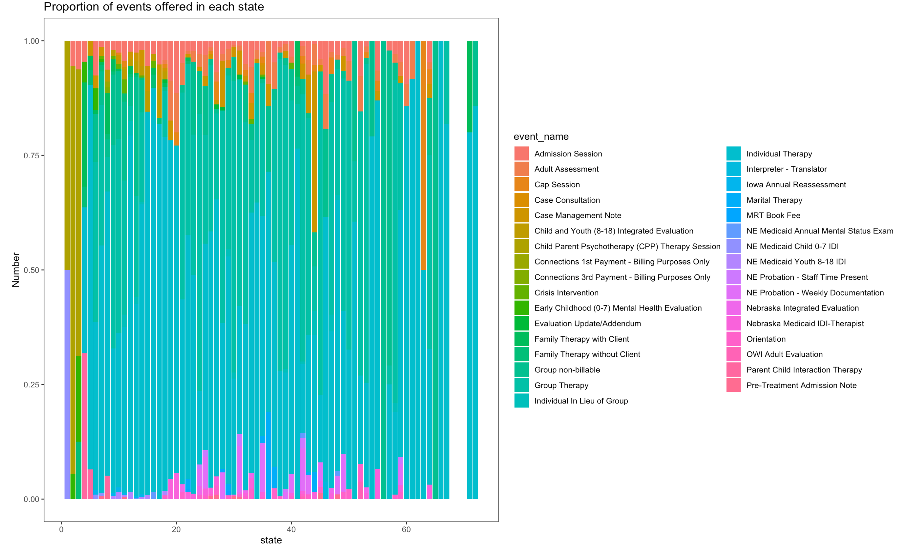

# Worstplot

## Q1. Boxplot(event_name vs age)

This was used determine for the events offered with the following age group present in the dataset.
```{r}
services.cleaned %>%
  drop_na(event_name) %>%
  ggplot(aes(age, fill = event_name))+
  geom_bar(position = "fill",
           alpha = 1)+
  theme_bw()+
  theme(panel.grid.major = element_blank(),
        panel.grid.minor = element_blank())+
         
  labs(x="state",y="Number",
  title = "Proportion of events offered for each age group")
```

<!-- -->


## Q2. Boxplot(event_name vs age)

This was used determine for the members who have likelihood insured with the average rate.
```{r}
services.cleaned %>%
  drop_na(avg_rate) %>%
  ggplot(aes(likelihood_insured, fill = avg_rate))+
  geom_bar(position = "fill",
           alpha = 1)+
  theme_bw()+
  theme(panel.grid.major = element_blank(),
        panel.grid.minor = element_blank())+
         
  labs(x="likelihood",y="avg_rate",
  title = "likelihood_insured vs avg_rate")
```

<!-- -->


## Q3. ScatterPlot (is_billable vs state)

This was to determine the data that each state tend to bill for their services.

```{r}
ggplot(services.cleaned, aes(x=is_billed, y=state)) + 
  geom_point(shape=18, color="blue")+
  geom_smooth(method=lm, se=FALSE, linetype="dashed",
             color="darkred")
```

<!-- -->
